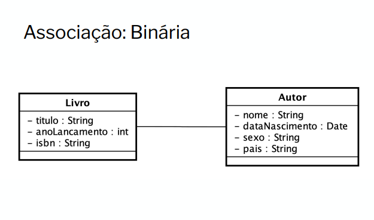
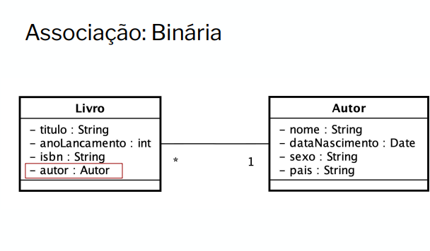
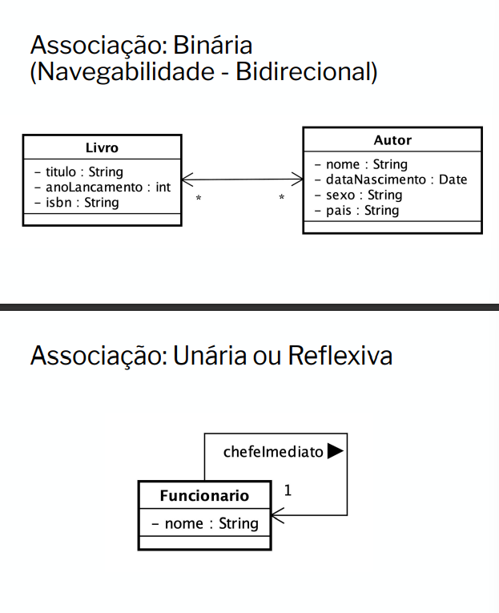
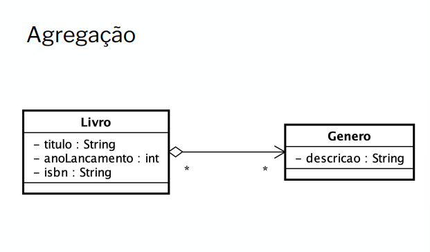

# Relacionamento entre classes

**As definições de relacionamentos e seus tipos são
conceituais, dessa forma, alguns pequenos detalhes
definem a diferença entres os tipos relacionamentos.**

## Tipos de Relacionamentos:

– Associação

– Agregação

– Composição

– *Herança*

“As classes costumam ter relacionamentos entre si,
chamados associações, que permitem que elas
compartilhem informações entre si e colaborem para a
execução dos processos executados pelo sistema. Uma
associação descreve um vínculo que ocorre normalmente
entre os objetos de uma ou mais classes”. 

---

### Associação Binária

A associação binária, é a relação comum e mais conhecida, entre duas classes comuns, 
na qual temos sua relação a partir da chamada como atributo do
**do objeto da classe pai...**

#### Exemplo:

---

### Associação: Cardinalidades

É a proporção de participação de um relacionamento;
As quatro cardinalidades comuns são:

– 1 para 1

– 1 para 1..* (muitos)

– * para 1

– * para *

### Exemplo:

---

### Agregação: 

”Agregação é um tipo especial de associação em que se tenta
demonstrar que as informações de um objeto (objeto-todo) são
complementadas pelas informações contidas em um ou mais objetos
no outro fim da associação (chamados objetos-parte). Esse tipo de
associação tenta demonstrar uma relação todo/parte entre os
objetos associados”;

- **O Todo seria o Objeto principal e a Parte o(s) Objeto(s) secundário(s);**

- **Na agregação o Objeto-parte é independente, ou seja, ele pode existir
sem o Objeto-todo;**

- **De forma geral, tem-se uma agregação quando um objeto não tem
exclusividade sobre o outro objeto. Ou seja, é quando um objeto faz
parte de outro, mas não depende dele para existir;**

---

### Composição: 

’Uma associação do tipo composição constitui-se em uma variação
da agregação, onde é apresentado um vínculo mais forte entre os
objetos-todo e os objetos-parte, procurando demonstrar que os
objetos-parte têm de estar associados a um único objeto-todo”.
Guedes, Gilleanes T. A.. UML 2 - Uma Abordagem Prática . Novatec Editora.

- Uma composição é uma agregação que possui dependência em
seu relacionamento;
– Em uma composição **um Objeto-parte não pode existir sem o
Objeto-todo, ou seja, o Objeto-todo tem uma exclusividade
com o Objeto-parte**;

❖ **Geralmente o seu relacionamento possui a cardinalidade 1 para ^.**
