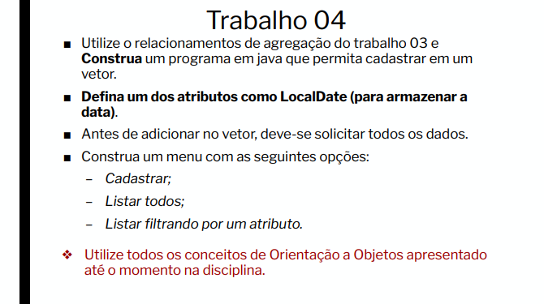

# Cadastro de carros

Este é um exemplo para uma atividade passada na aula, essa a 5°,
quando precisávamos criar classes para cadastro de carros. ainda
a expressão de imprimir os carros cadastrados por um array.

