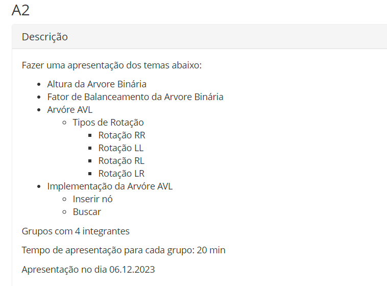

# Prova A2

O exercício avaliativo 2 do semestre de estrutura de dados, foi definido por
um avaliação de um código de árvore binária, e árvore AVL, com seus respectivos métodos, na qual
temos: 

- Cada parte de cada exercício foi documentado, explicado, apresentado, e aqui contém também o slide de apresentação
usado pelo grupo, apresentado na hora, aproveite e veja o material!

---