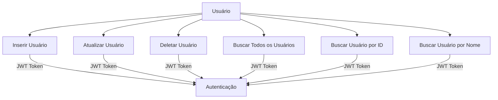

# Documentação de Testes JUnit da Aplicação

## Introdução

Esta documentação descreve os testes JUnit desenvolvidos para a aplicação `br.unitins.topicos1`. Os testes têm como objetivo verificar a funcionalidade e a integridade dos serviços da aplicação, garantindo que os endpoints e operações CRUD (Create, Read, Update, Delete) funcionem conforme o esperado.

## Estrutura dos Testes

Os testes foram implementados utilizando o framework JUnit e a biblioteca RestAssured para testar endpoints RESTful. A classe de teste principal é `UsuarioResourceTest`, que contém testes para as operações básicas do recurso `Usuario`.

### Dependências

- **JUnit**: Framework de testes unitários.
- **RestAssured**: Biblioteca para testes de APIs REST.
- **QuarkusTest**: Para rodar os testes com o contexto do Quarkus.

## Descrição dos Testes

### Testes Implementados

1. **testInsert**
2. **testUpdate**
3. **testDelete**
4. **testFindAll**
5. **testFindById**
6. **testFindByNome**

### Detalhamento dos Testes

#### 1. testInsert

**Descrição**: Testa a inserção de um novo usuário.

```java
@Test
public void testInsert() {
    LoginDTO loginDTO = new LoginDTO("musk", "senha1");
    String hashSenha = hashService.getHashSenha(loginDTO.senha());
    UsuarioResponseDTO result = usuarioService.findByLoginAndSenha(loginDTO.login(), hashSenha.toString());
    UsuarioDTO usuarioDTO = new UsuarioDTO(
        "John Doe",
        "john.doe",
        "12312312312" ,
        "senha123",
        1,
        null);

    String tokenUser = jwtService.generateJwt(result);

    given()
        .headers("Authorization", "Bearer " + tokenUser)
        .contentType(ContentType.JSON)
        .body(usuarioDTO)
        .when().post("/usuarios")
        .then()
        .statusCode(201);
}
```

**Objetivo**: Verificar se a API consegue inserir um novo usuário e retornar o status 201 (Criado).

#### 2. testUpdate

**Descrição**: Testa a atualização de um usuário existente.

```java
@Test
public void testUpdate() {
    LoginDTO loginDTO = new LoginDTO("musk", "senha1");
    String hashSenha = hashService.getHashSenha(loginDTO.senha());
    UsuarioResponseDTO result = usuarioService.findByLoginAndSenha(loginDTO.login(), hashSenha.toString());
    UsuarioDTO usuarioDTO = new UsuarioDTO(
            "John Doe",
            "john.doe",
            "12312312312" ,
            "senha123",
            1,
            null);

    String tokenUser = jwtService.generateJwt(result);
    given()
            .headers("Authorization", "Bearer " + tokenUser)
            .contentType(ContentType.JSON)
        .body(usuarioDTO)
        .when()
        .put("/usuarios/1")
        .then()
        .statusCode(204);
}
```

**Objetivo**: Verificar se a API consegue atualizar um usuário existente e retornar o status 204 (Sem Conteúdo).

#### 3. testDelete

**Descrição**: Testa a exclusão de um usuário existente.

```java
@Test
public void testDelete() {
    LoginDTO loginDTO = new LoginDTO("gates", "senha2");
    String hashSenha = hashService.getHashSenha(loginDTO.senha());
    UsuarioResponseDTO result = usuarioService.findByLoginAndSenha(loginDTO.login(), hashSenha.toString());

    String tokenAdm = jwtService.generateJwt(result);
    given()
            .headers("Authorization", "Bearer " + tokenAdm)
            .contentType(ContentType.JSON)
        .when()
        .delete("/usuarios/1")
        .then()
        .statusCode(204);
}
```

**Objetivo**: Verificar se a API consegue excluir um usuário e retornar o status 204 (Sem Conteúdo).

#### 4. testFindAll

**Descrição**: Testa a busca de todos os usuários.

```java
@Test
public void testFindAll() {
    LoginDTO loginDTO = new LoginDTO("musk", "senha1");
    String hashSenha = hashService.getHashSenha(loginDTO.senha());
    UsuarioResponseDTO result = usuarioService.findByLoginAndSenha(loginDTO.login(), hashSenha.toString());

    String tokenUser = jwtService.generateJwt(result);
    given()
            .headers("Authorization", "Bearer " + tokenUser)
            .contentType(ContentType.JSON)
        .when()
        .get("/usuarios")
        .then()
        .statusCode(200);
}
```

**Objetivo**: Verificar se a API retorna todos os usuários e retornar o status 200 (OK).

#### 5. testFindById

**Descrição**: Testa a busca de um usuário específico pelo ID.

```java
@Test
public void testFindById() {
    LoginDTO loginDTO = new LoginDTO("musk", "senha1");
    String hashSenha = hashService.getHashSenha(loginDTO.senha());
    UsuarioResponseDTO result = usuarioService.findByLoginAndSenha(loginDTO.login(), hashSenha.toString());

    String tokenUser = jwtService.generateJwt(result);
    given()
            .headers("Authorization", "Bearer " + tokenUser)
            .contentType(ContentType.JSON)
        .when()
        .get("/usuarios/1")
        .then()
        .statusCode(200);
}
```

**Objetivo**: Verificar se a API retorna um usuário específico pelo ID e retornar o status 200 (OK).

#### 6. testFindByNome

**Descrição**: Testa a busca de usuários pelo nome.

```java
@Test
public void testFindByNome() {
    LoginDTO loginDTO = new LoginDTO("musk", "senha1");
    String hashSenha = hashService.getHashSenha(loginDTO.senha());
    UsuarioResponseDTO result = usuarioService.findByLoginAndSenha(loginDTO.login(), hashSenha.toString());

    String tokenUser = jwtService.generateJwt(result);
    given()
            .headers("Authorization", "Bearer " + tokenUser)
            .contentType(ContentType.JSON)
        .when()
        .get("/usuarios/search/nome/John")
        .then()
        .statusCode(200);
}
```

**Objetivo**: Verificar se a API retorna usuários pelo nome e retornar o status 200 (OK).

## Diagrama de Casos de Uso dos Testes



## Conclusão

Os testes JUnit foram desenvolvidos para cobrir as principais operações da API de usuários, garantindo que as funcionalidades de inserção, atualização, exclusão e busca de usuários estejam operando corretamente. Os testes utilizam JWT para autenticação, assegurando que apenas usuários autenticados possam realizar operações protegidas.