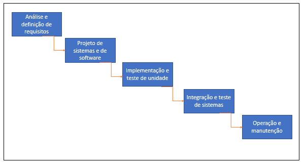

# Engenharia de Software

Matéria utilizada na gestão de processos dentro de um desenvolvimento de um software. Utilizando metodologias de trabalho e organização para
para vez melhor gerir todo esse processo.

Com a necessidade dos anos 60 de correção dos problemas que haviam, que custavam muito tempo e dinheiro, começou a ser pensado a melhor hipóteses, que era melhor planejar a concertar.

Dentro dessa visão, a primeira coisa ser instituída, foram etapas do desenvolvimento de software, em que se dividiam dessa forma:

---

## Modelos de organização

Existem alguns modelos de planejamento de software que temos, que podem também ser adicionadas a tipos que construção em um software. Entendendo que tudo, desde o primórdio modelo existiu foi uma evolucão ao ultimo que surgiu, que melhora o processo e as etapas do ultimo modelo.

---

A implementação do software e entrega de versões passa por dois tipos principais que são distinguidas diferentemente passados pelas versões.

Podendo ser incremental ou iterativo.

---
