## Estrutura da Rede

O cenário de rede consiste em:
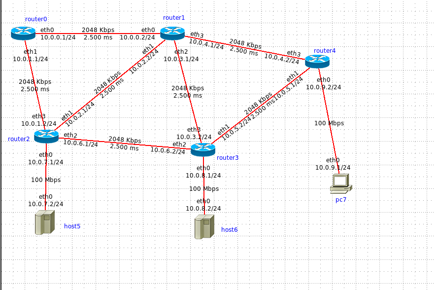
- **Roteadores**: Quatro roteadores interconectados (`router1`, `router1`, `router2`, `router3`, `router4`).
- **Hosts**: Conectado a dois hosts, (`host5`, `host6`)
- **PCs**: Estações de trabalho finais conectadas a diferentes sub-redes (`pc7`).
  
### Endereçamento IP

Entendendo o roteamento, quando vamos conectar a redes, temos os seguintes comandos:

```cmd
# Iniciando configuração
config t
```

E assim precisamos entender a rota, o roteador que começamos, e assim ele tem um IP, e assim ele precisa enxergar os outros. 

Só que já que ele não está enxergando diretamente os outros roteadores, ele somente consegue enxergar através dos outros roteadores.

- ### Exemplo: 

```cmd
# Conectando ip
ip route 10.0.4.0/24 10.0.0.2

# Encerrando
end 

# Verificando a conexão

sh ip route

# Resultados:

10.0.3.0/24 via 10.0.0.2 connected
```

- ### Ping: 

```cmd
ping 10.0.0.2
```
### Print de base como exemplo:

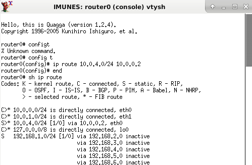


Neste resultado só precisamos entender que ele está conectado através de outro IP, e esse IP é seu IP inicial, e assim ele está conversando com outros roteadores.

A partir daí só precisamos fazer isso com os outros IP's dos roteadores...

---

## Próximos IP's

Agora prints dos comandos e das conexões feitas provando a teoria.

- ### A partir do route 0:

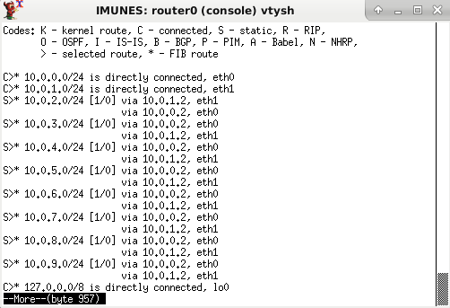

- #### Ping para um exemplo:

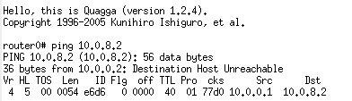

- ### A partir do route 2:

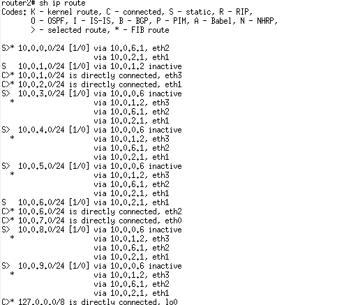

- #### Ping para um exemplo do route 2

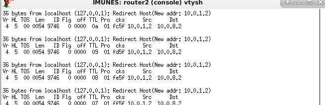

- ### A partir do route 1:
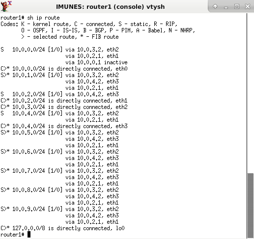

- #### Ping para um exemplo do route 1

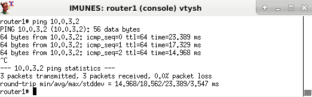

- ### A partir do route 3:
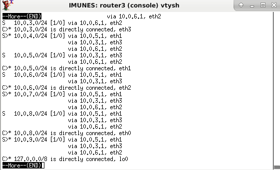

- #### Ping para um exemplo:
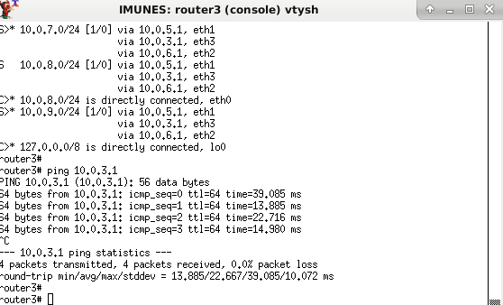

- ### A partir do route 4:
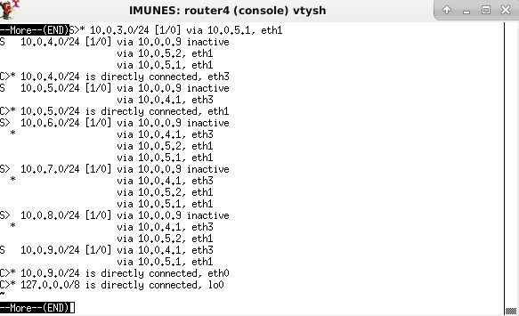

- #### Ping para um exemplo:

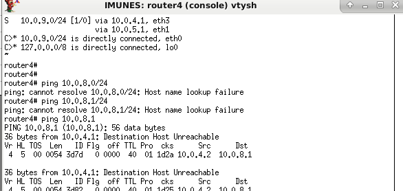


---

