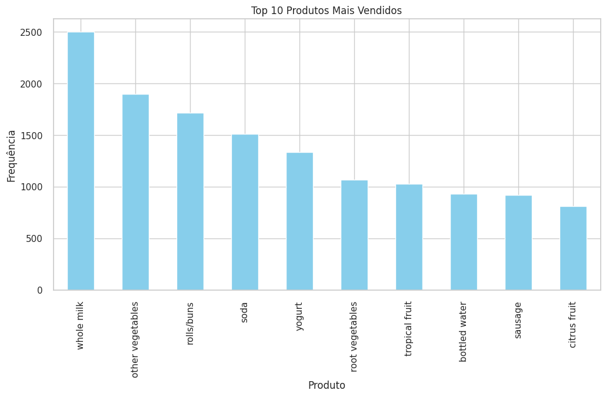
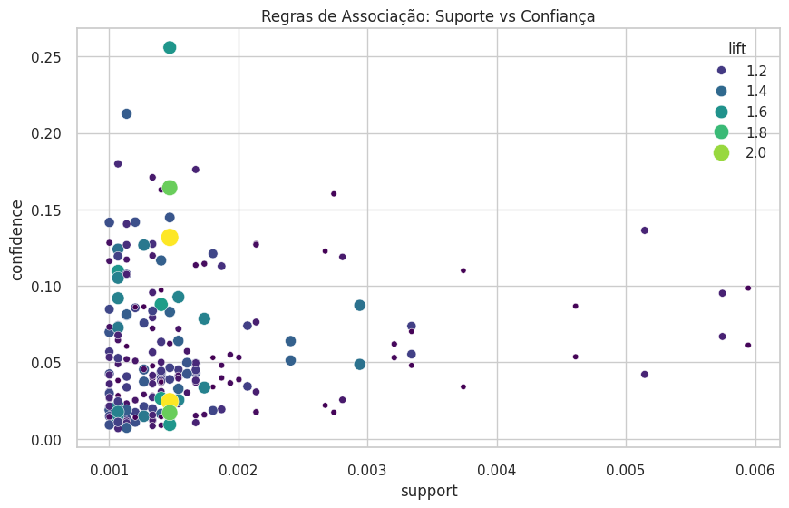

# Documentação da Atividade: Regras de Associação e Detecção de Anomalias

Este documento detalha a atividade realizada no arquivo `regras_associacao.ipynb`, explicando o dataset, a metodologia, os códigos utilizados e a interpretação dos resultados.

## 1. O Dataset (Groceries)

O dataset utilizado contém dados transacionais de um supermercado.
- **Fonte**: [Groceries Dataset no Kaggle](https://www.kaggle.com/datasets/heeraldedhia/groceries-dataset).
- **Estrutura**: O arquivo CSV possui linhas representando itens comprados individualmente.
- **Colunas Principais**:
    - `Member_number`: Identificador único do cliente.
    - `Date`: Data da realização da compra.
    - `itemDescription`: Nome do produto comprado (ex: *whole milk*, *yogurt*).

### Definição de Transação
Como o dataset lista itens linha a linha, definimos uma **transação** (ou cesta de compras) como o conjunto de todos os itens comprados pelo mesmo membro (`Member_number`) na mesma data (`Date`).

---

## 2. Metodologia e Ferramentas

A atividade foi dividida em duas partes principais, conforme instruções e adaptações necessárias:

1.  **Regras de Associação (Association Rules)**: Utilizando a biblioteca `mlxtend`.
    - *Motivo*: O PyCaret descontinuou o módulo nativo de regras de associação em versões recentes, sendo o `mlxtend` a ferramenta padrão de mercado para esta tarefa em Python.
2.  **Detecção de Anomalias (Anomaly Detection)**: Utilizando a biblioteca `PyCaret`.
    - *Motivo*: Atender à solicitação de uso do PyCaret, identificando comportamentos de compra atípicos (outliers).

---

## 3. Explicação dos Códigos e Parâmetros

### A. Preparação dos Dados
Antes da análise, os dados foram transformados:
- **Agrupamento**: `df.groupby(['Member_number', 'Date'])` para juntar itens na mesma cesta.
- **One-Hot Encoding (`TransactionEncoder`)**: Transforma a lista de produtos em uma matriz gigante onde as colunas são os produtos e as linhas são as transações.
    - `1` (ou `True`): O produto estava na cesta.
    - `0` (ou `False`): O produto não estava.

### B. Regras de Associação (Algoritmo Apriori)
Código principal:
```python
frequent_itemsets = apriori(df_trans, min_support=0.001, use_colnames=True)
rules = association_rules(frequent_itemsets, metric="lift", min_threshold=1.0)
```

**Parâmetros Explicados:**
- **`min_support=0.001` (0.1%)**:
    - Define que um conjunto de itens deve aparecer em pelo menos 0.1% de todas as transações para ser considerado "frequente".
    - *Por que tão baixo?* Em supermercados, a variedade de produtos é enorme. A chance de uma combinação específica (ex: "Cerveja + Fralda + Amendoim") acontecer é naturalmente baixa em relação ao total de vendas. Valores altos (como 5% ou 10%) geralmente não retornam resultado nenhum em datasets esparsos como este.
- **`metric="lift"` e `min_threshold=1.0`**:
    - Filtramos apenas regras onde o **Lift** seja maior ou igual a 1.0.
    - **Lift > 1**: Indica uma associação positiva (quem compra A tem *mais* chance de comprar B do que uma pessoa aleatória).
    - **Lift = 1**: Independência (comprar A não muda a chance de comprar B).


## 4. Resultados e Gráficos Gerados

### Gráfico 1: Top 10 Produtos Mais Vendidos (Barras)
- **O que mostra**: Os itens mais populares individualmente.
- **Insight**: Produtos como *whole milk* (leite integral) e *vegetables* (vegetais) costumam ser a base das cestas, aparecendo em muitas regras.



### Gráfico 2: Scatter Plot (Suporte x Confiança x Lift)
- **Eixo X (Suporte)**: Quão frequente é a regra.
- **Eixo Y (Confiança)**: Quão forte é a regra (dado A, qual a chance de B?).
- **Cor/Tamanho (Lift)**: A qualidade da associação.

### 6. Sabedoria do Gráfico: O que ele nos diz?



#### A. A "Nuvem" (Canto Inferior Esquerdo)
- **O que é**: A grande massa de pontos roxos e pequenos aglomerados no canto esquerdo.
- **Significado**: São combinações de produtos que acontecem, mas são fracas (Lift baixo) ou muito raras.
- **Ação**: **Ignorar**. Geralmente são coincidências ou compras de rotina sem padrão claro.

#### B. As "Anomalias Visuais" (O Ouro)
- **O que é**: Os pontos que **fogem** dessa nuvem. Olhe para os pontos **Verdes/Amarelos** e **Grandes** que estão mais altos no gráfico.
- **Significado**: Estas são as regras de **Alto Lift**. Elas representam comportamentos de compra muito específicos e fortes.
    - Exemplo: O ponto amarelo grande no topo representa uma regra onde a compra de A aumenta drasticamente a chance de comprar B.
- **Sabedoria para o Negócio**:
    - Esses pontos são **oportunidades de lucro**. Eles mostram desejos ocultos do consumidor.
    - **Estratégia**: Crie promoções focadas APENAS nesses pontos. Não gaste marketing na "nuvem".

#### C. Quais Anomalias Apresentar?
Dois tipos de "anomalias" (coisas fora do comum), mas não as confunda:

1.  **Anomalias de Regra (Neste Gráfico)**:
    - **Apresente**: Os pontos que estão isolados no topo ou com cores claras (Lift > 1.8).
    - **Por que?**: Eles provam que você achou padrões que a concorrência não vê. Mostre que "Iogurte+Leite -> Salsicha" é um ponto fora da curva estatística.

2.  **Anomalias de Transação (Do PyCaret)**:
    - **Apresente**: As compras identificadas pelo Isolation Forest (seção PyCaret do notebook).
    - **Por que?**: Elas mostram erros operacionais ou fraudes. Ex: Uma compra com 50 itens iguais, ou uma cesta com produtos que nunca são vendidos juntos. Isso é segurança e eficiência operacional.

---

## 5. Análise Descritiva das Regras Identificadas

Abaixo, detalhamos os padrões de comportamento descobertos pelo algoritmo, explicando o "porquê" dessas associações existirem no contexto de compras de supermercado.

### Principais Descobertas

1.  **O "Combo do Café da Manhã Completo" (Leite, Iogurte e Salsicha)**
    *   **Regra:** `(Iogurte, Leite Integral) -> (Salsicha)`
    *   **Lift:** 2.18 (A associação mais forte encontrada).
    *   **Explicação:** Existe uma conexão íntima entre produtos de laticínios básicos e embutidos. Quem está abastecendo a geladeira com itens de café da manhã (leite e iogurte) tem **duas vezes mais chances** de levar salsicha do que um cliente aleatório. Isso sugere a compra para uma refeição específica (café reforçado ou jantar rápido).

2.  **O Perfil "Gourmet/Sobremesa" (Chocolate e Cítricos)**
    *   **Regra:** `(Chocolate Especial) -> (Frutas Cítricas)`
    *   **Lift:** 1.65.
    *   **Explicação:** Uma associação interessante e menos óbvia. Clientes que compram chocolates diferenciados ("specialty chocolate") tendem a comprar frutas cítricas. Isso pode indicar um perfil de consumidor que busca sabores contrastantes ou ingredientes para receitas de confeitaria (ex: bolo de laranja com chocolate).

3.  **Ingredientes para Preparo (Frutas Tropicais e Farinha)**
    *   **Regra:** `(Frutas Tropicais) -> (Farinha)`
    *   **Lift:** 1.61.
    *   **Explicação:** A compra conjunta de farinha e frutas sugere fortemente a intenção de cozinhar em casa, provavelmente bolos, tortas ou sobremesas caseiras. O algoritmo detectou que a farinha não é comprada apenas aleatoriamente, mas frequentemente "puxada" pela presença de frutas no carrinho.

### Interpretação do Comportamento

A aplicação das regras de associação no dataset Groceries revelou que o comportamento de compra não é aleatório, mas guiado por **missões de compra** específicas.

O padrão mais evidente é a **complementaridade de proteínas e laticínios**. A regra que liga *Iogurte* e *Leite* à *Salsicha* demonstra que esses itens, embora de categorias diferentes (frios vs laticínios), compõem uma "cesta básica de perecíveis" para muitas famílias. O alto valor de **Lift (2.18)** confirma que essa não é uma coincidência: a presença dos laticínios atua quase como um gatilho para a lembrança ou necessidade da compra da salsicha.

Além do básico, identificamos nichos de **culinária doméstica**. A associação entre *Farinha* e *Frutas Tropicais*, bem como *Chocolate Especial* e *Frutas Cítricas*, aponta para clientes que não estão apenas repondo despensa, mas planejando receitas. Para o supermercado, isso significa que colocar esses itens próximos (cross-merchandising) ou criar ofertas conjuntas ("Leve farinha com desconto na compra de frutas") seria uma estratégia altamente eficaz baseada em dados reais, e não apenas em intuição.

---

### Tabela de Regras (DataFrame) - Detalhes Técnicos

A tabela gerada pelo `association_rules` contém diversas métricas estatísticas. Abaixo, explicamos o significado de cada coluna com base no exemplo: `(yogurt, whole milk) -> (sausage)`.

| Coluna | Significado | Exemplo (Linha 236) | Interpretação |
| :--- | :--- | :--- | :--- |
| **antecedents** | O item ou conjunto "Gatilho" (SE...). | `(yogurt, whole milk)` | "Se o cliente comprou Iogurte E Leite..." |
| **consequents** | O item "Alvo" (...ENTÃO). | `(sausage)` | "...ele também comprou Salsicha." |
| **antecedent support** | Frequência apenas do antecedente. | `0.011161` (1.11%) | 1.11% de todas as cestas tinham Iogurte + Leite. |
2. Combina os restantes em pares (leite+pão, leite+ovos). Conta novamente e elimina os raros.
3. Combina em trios, e assim por diante, até não conseguir mais formar grupos frequentes.

### Passo 2: Gerar Regras a partir dos Itemsets
Para cada grupo frequente encontrado (ex: {A, B, C}), o algoritmo testa todas as combinações de regras:
- Se {A, B, C} é frequente, testamos:
    - `A -> B, C`
    - `A, B -> C`
    - `C -> A, B`
    - etc.
- Uma regra é mantida apenas se atender ao critério de métrica escolhido (no nosso código, `lift >= 1.0` ou `confidence` mínima).

Isso garante que não estamos apenas "chutando" associações, mas sim encontrando padrões matematicamente relevantes dentro do histórico de compras.

### Detecção de Anomalias
- O PyCaret adiciona colunas `Anomaly` (1 = anômalo, 0 = normal) e `Anomaly_Score`.
- **Interpretação**: Transações marcadas como anômalas podem representar:
    - Compras de volume muito acima da média.
    - Combinações de produtos muito raras ou estranhas.
    - Erros de registro no sistema.


### C. Detecção de Anomalias (PyCaret)
Código principal:
```python
exp_ano = setup(df_trans, session_id=123)
iforest = create_model('iforest')
```

**Modelos e Configurações:**
- **`iforest` (Isolation Forest)**:
    - É um algoritmo eficiente para detecção de anomalias em grandes dimensões.
    - *Como funciona*: Ele isola observações selecionando aleatoriamente uma característica e um valor de corte. Pontos anômalos são isolados mais rapidamente (precisam de menos cortes) do que pontos normais.
- **`session_id=123`**: Garante que os resultados sejam reproduzíveis (sempre os mesmos resultados ao rodar de novo).

---

