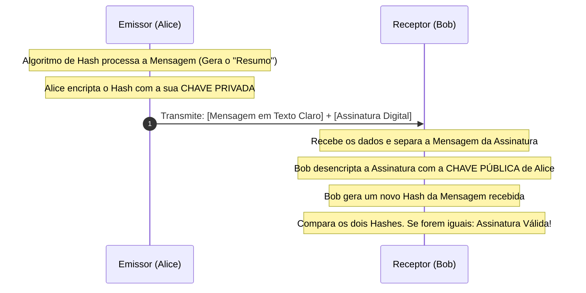

# Assinaturas Digitais, Certificados e Infraestrutura (PKI)

Esta secção aborda os mecanismos que garantem a autenticidade e a integridade da comunicação: as assinaturas digitais e a infraestrutura de chaves públicas.

---

## 6. Assinaturas Digitais

A encriptação de chave pública, por si só, não garante quem enviou a mensagem (qualquer pessoa pode usar a chave pública de um destinatário para lhe enviar ficheiros). Para garantir a origem e a integridade dos dados, inverte-se o uso das chaves, criando a **Assinatura Digital**.

### 6.1 Princípio de Funcionamento

Em vez de encriptar a mensagem inteira (o que seria computacionalmente dispendioso), o processo de assinatura digital utiliza **Funções de Hash Criptográfico** (como o SHA-256).

**Propriedades garantidas:**

1. **Autenticação de Origem:** Garante que a mensagem foi criada pelo detentor da chave privada.
2. **Integridade de Dados:** Garante que a mensagem não foi alterada em trânsito (qualquer alteração, por menor que seja, muda completamente o hash).
3. **Irretratabilidade (Não-repúdio):** O emissor não pode negar posteriormente ter enviado a mensagem, pois apenas a sua chave privada poderia ter gerado aquela assinatura matemática específica.

### 6.2 O Processo de Assinatura e Verificação (Esquema Visual)

O diagrama abaixo ilustra o fluxo exato de como um pacote de dados é assinado e validado:

---

## 7. Exemplos Práticos de Aplicações

As assinaturas digitais são a espinha dorsal da segurança moderna, integradas em praticamente todas as interações digitais. A tabela abaixo contextualiza as aplicações do conceito:

| Cenário de Aplicação | Como a Assinatura Digital é Utilizada | Objetivo Principal |
| --- | --- | --- |
| **Arquitetura de Plataformas SaaS** | Em sistemas distribuídos, a gestão de sessões requer segurança estrita. A geração de *JSON Web Tokens* (JWT) num backend construído em Node.js ou NestJS envolve a assinatura do cabeçalho e da carga útil (payload) do token com uma chave secreta ou privada. | Garantir que o cliente não manipula os seus próprios privilégios de acesso ou dados financeiros antes de enviar o token de volta para a API. |
| **Infraestrutura e Cloud (AWS)** | A comunicação entre diferentes microsserviços (por exemplo, invocação de lambdas via API Gateway) exige validação rigorosa. As requisições são assinadas digitalmente (como o processo AWS Signature Version 4). | Assegurar a identidade do serviço que faz a chamada e garantir que os parâmetros da requisição não foram intercetados e modificados. |
| **Controlo de Versões (Git)** | A assinatura de *commits* utilizando chaves GPG ou SSH. | Provar de forma irrefutável que uma alteração específica no código-fonte de um sistema crítico foi submetida pelo programador autorizado. |
| **Atualizações de Software** | Os sistemas operativos (Windows, macOS, Linux) verificam a assinatura digital anexada a pacotes de instalação antes de os executarem. | Prevenir a instalação de código malicioso disfarçado de atualização legítima (combate a ataques de cadeia de fornecimento). |

---

## 8. Certificados Digitais e a Norma X.509

Um problema inerente à criptografia assimétrica é a fraude de identidade: como posso ter a certeza de que a chave pública que descarreguei da internet pertence realmente à instituição financeira com a qual quero comunicar, e não a um atacante que criou um par de chaves falso?

A solução apresentada no livro é o **Certificado Digital**, regulamentado pelo padrão X.509.

### 8.1 O que é um Certificado X.509?

Um certificado digital atua como um bilhete de identidade eletrónico. É um documento de dados que liga, de forma matemática e legal, uma Chave Pública a uma entidade específica (uma pessoa, uma empresa, ou o domínio de um servidor web).

**Estrutura principal de um Certificado X.509:**

* **Versão e Número de Série:** Identificadores únicos.
* **Algoritmo de Assinatura:** O método utilizado pela entidade certificadora para assinar o documento.
* **Emissor (Issuer):** O nome da Autoridade Certificadora que validou e emitiu o certificado.
* **Validade:** Data de início e data de expiração.
* **Sujeito (Subject):** A entidade a quem o certificado pertence (ex: `www.financepro.com`).
* **Chave Pública do Sujeito:** A chave pública que está a ser atestada.
* **Assinatura Digital da Autoridade:** O hash de todo o certificado, encriptado com a chave privada da Autoridade Certificadora.

---

## 9. Entidades Certificadoras (CAs - Certificate Authorities)

As Entidades Certificadoras são o pilar de confiança da infraestrutura de chaves públicas (PKI). São organizações terceiras, universalmente confiáveis, responsáveis por verificar a identidade de um requerente antes de emitir um certificado X.509.

### 9.1 Cadeia de Confiança (Chain of Trust)

A confiança não é depositada de forma aleatória; ela segue uma estrutura hierárquica estrita:

1. **Root CAs (Autoridades Raiz):** São o topo da hierarquia. Os seus certificados são "autoassinados" e vêm pré-instalados de fábrica nos sistemas operativos, bases de dados e navegadores web. Se a chave raiz de uma CA for comprometida, todos os certificados emitidos sob ela perdem a validade globalmente.
2. **Intermediate CAs (Autoridades Intermédias):** Por motivos de segurança, as Root CAs mantêm as suas chaves privadas offline. Utilizam essas chaves apenas para assinar certificados de CAs Intermédias, que por sua vez realizam o trabalho diário de emissão de certificados para o público.
3. **End-Entity Certificates (Certificados Finais):** Os certificados SSL/TLS atribuídos aos servidores web, APIs, ou aplicações de software.

**Exemplos Reais de Autoridades Certificadoras:**

* **Let's Encrypt:** Uma autoridade certificadora gratuita, automatizada e aberta, amplamente utilizada para assegurar o tráfego web (HTTPS).
* **DigiCert / IdenTrust:** CAs comerciais de grande escala que fornecem certificados de validação estendida (EV) para instituições financeiras e grandes corporações.
* **AWS Certificate Manager (ACM):** Atua como uma CA para gerir e aprovar certificados SSL/TLS especificamente dentro do ecossistema de serviços da Amazon Web Services.

---

## 10. Referências Bibliográficas

* **Stallings, W. (2014).** *Criptografia e Segurança de Redes: Princípios e Práticas* (6ª Edição). Pearson Education do Brasil.
* Base fundamental para os conceitos de Criptografia Assimétrica, Algoritmo RSA e Complexidade de Algoritmos (Capítulos 9 e Apêndice 20A).
* Base técnica para a formulação de Assinaturas Digitais, Funções de Hash e Autenticação (Capítulos 11, 12 e 13).
* Regulamentação e estrutura de Infraestrutura de Chaves Públicas e padrão X.509 (Capítulo 14).

* **Diffie, W., & Hellman, M. (1976).** *New Directions in Cryptography*. IEEE Transactions on Information Theory. (Referenciado na obra para a teoria das chaves públicas).
* **Rivest, R., Shamir, A., & Adleman, L. (1978).** *A Method for Obtaining Digital Signatures and Public-Key Cryptosystems*. Communications of the ACM. (Referenciado na obra para a fundação matemática do RSA).
