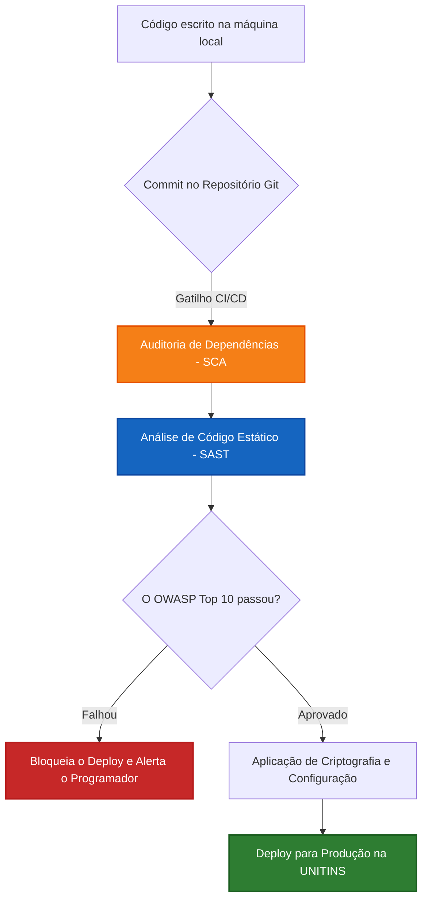

# Relatório de Auditoria Prática: Segurança no Ciclo de Desenvolvimento (SDLC)

**Alvo da Auditoria:** Sistema SoftwareHub (Gestão de Registos de Software)
**Foco:** CIS Control 16 (Application Software Security) e Proteção Criptográfica de Dados.

## 1. O Cenário de Avaliação

O objetivo do Controlo 16 é garantir que a segurança seja incorporada no código desde a primeira linha, e não adicionada como um penso rápido no final do projeto. Numa auditoria real, o auditor não olha apenas para o servidor a correr; ele analisa o fluxo de trabalho da equipa de desenvolvimento.

### 1.1 Diagrama de Fluxo Auditado (O Pipeline Seguro)

O auditor exigirá provas de que o processo de *deploy* do SoftwareHub segue um pipeline de Integração Contínua/Entrega Contínua (CI/CD) com portões de segurança.

---

## 2. Execução da Auditoria: Mapeamento de Salvaguardas (CIS v8)

Abaixo estão as verificações práticas que um auditor realizaria na arquitetura do sistema e as evidências que devem ser apresentadas.

### Fase 1: Gestão de Componentes de Terceiros (Salvaguarda 16.2)
Sistemas modernos raramente são escritos do zero. Um projeto *full stack* utiliza pacotes do NPM (Node.js), Pip (Python) ou Composer.
* **O que o auditor procura:** Como é garantido que uma biblioteca desatualizada não introduz uma falha crítica no sistema de registos?
* **A Evidência Exigida:** Demonstração de uma ferramenta de *Software Composition Analysis* (SCA), como o Snyk ou o GitHub Dependabot, configurada para analisar o ficheiro `package.json` a cada *commit*. Se uma biblioteca possuir uma vulnerabilidade crítica (CVE), o *deploy* deve falhar automaticamente.

### Fase 2: Identificação de Vulnerabilidades no Código (Salvaguarda 16.3)
* **O que o auditor procura:** O código-fonte que processa as submissões de novos programas informáticos está imune a Injeções de SQL (SQLi) ou *Cross-Site Scripting* (XSS)?
* **A Evidência Exigida:** Relatórios de uma ferramenta de *Static Application Security Testing* (SAST), como o SonarQube, integrada no fluxo. A plataforma deve varrer o código escrito à procura de más práticas antes que ele chegue ao servidor.

### Fase 3: Separação Rigorosa de Ambientes (Salvaguarda 16.8)
* **O que o auditor procura:** O ambiente de "Teste/Desenvolvimento" utiliza dados reais dos investigadores e alunos da universidade?
* **A Evidência Exigida:** Prova arquitetural de que os ambientes de *Desenvolvimento*, *Staging* e *Produção* estão isolados. Se for necessário usar dados reais para testes, a equipa deve comprovar o uso de *Data Masking* (anonimização dos nomes e documentos originais).

---

## 3. A Implementação Criptográfica (A intersecção com Stallings)

O CIS Controls exige proteção de dados, mas é a teoria matemática do livro de Stallings que dita **como** essa proteção deve ser implementada no código do SoftwareHub para passar na auditoria.

### 3.1 Proteção da Propriedade Intelectual (Dados em Repouso)
Os registos de código-fonte e patentes de software submetidos no sistema são altamente confidenciais. Se um atacante aceder à base de dados de forma não autorizada (exibindo um *dump* do SQL), a informação não pode ser legível.
* **A Solução Técnica:** A base de dados (ex: PostgreSQL ou MongoDB) deve ter a encriptação transparente de dados (TDE) ativada, utilizando **Criptografia Simétrica (AES-256)**.
* **Avaliação do Auditor:** O auditor verificará se a chave AES de encriptação está armazenada no mesmo servidor que a base de dados. Se estiver, é uma Não Conformidade (se o servidor for invadido, o atacante rouba o cofre e a chave). A chave deve ser gerida por um cofre externo (como o AWS KMS ou HashiCorp Vault).

### 3.2 Autenticidade das Submissões (Assinatura Digital)
Como a coordenação de ciências exatas pode ter a certeza de que o aluno "A" realmente submeteu o Registo do Software "X" às 14:00, e que ninguém alterou o documento depois disso?
* **A Solução Técnica:** Aplicação prática dos Capítulos 11 e 13 do livro. Quando o utilizador faz o *upload* da documentação do programa, o sistema *backend* deve:
  1. Gerar um **Hash SHA-256** do ficheiro.
  2. Assinar esse Hash utilizando a **Chave Privada** do sistema (ou do utilizador, via integração PKI).
* **Avaliação do Auditor:** A funcionalidade de "Irretratabilidade" (Non-repudiation) será validada, garantindo que o autor original não pode negar ter feito a submissão e que nenhum administrador alterou o ficheiro diretamente na base de dados (qualquer alteração corromperia a verificação do Hash).

---

## 4. Matriz de Resultados (Exemplo de Entregável da Atividade)

Caso necessite redigir um parecer final para o seu trabalho académico baseado nesta simulação, utilize a tabela de conformidade abaixo:

| Controlo CIS v8 / Princípio | Elemento Inspecionado no SoftwareHub | Estado da Auditoria | Plano de Ação (Correção) |
| :--- | :--- | :--- | :--- |
| **16.2 (Gestão de 3rd Party)** | Ficheiros de dependências (`package.json`, `requirements.txt`). | ✅ **Conforme** | Manter varrimentos automatizados semanais via pipeline CI/CD. |
| **16.3 (Código Seguro)** | Módulos de pesquisa e submissão de formulários web. | ⚠️ **Parcial** | Implementar *Prepared Statements* (Consultas Parametrizadas) em todas as *queries* à base de dados para mitigar risco de SQL Injection. |
| **16.8 (Separação de Dados)** | Base de dados do ambiente de desenvolvimento local. | ❌ **Não Conforme** | Dados de utilizadores reais foram encontrados na máquina de desenvolvimento. Implementar rotina obrigatória de mascaramento de dados (Data Masking) antes da replicação. |
| **Criptografia (Stallings)** | Armazenamento dos documentos de registo de software (Discos). | ✅ **Conforme** | Encriptação AES-256 confirmada no armazenamento (S3/Volume). Chaves devidamente geridas em KMS isolado. |
